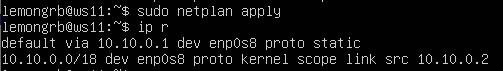
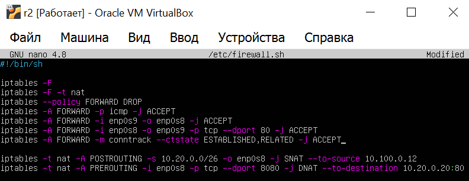
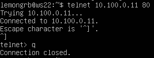

# D02_LinuxNetwork-1_s21_lemongrb

## Part 1. Инструмент ipcalc

* 1.1. Сети и маски
  
  **IPcalc** - это утилита командной строки, которая используется для вычисления различных параметров IP-адресов и сетей. С помощью IPcalc можно вычислить маску подсети, диапазон IP-адресов, широковещательный адрес, сетевой адрес и другие параметры для заданного IP-адреса и маски подсети.

  Установим ipcalc - `sudo apt install ipcalc`.

  1) Определим адрес сети 192.167.38.54/13, он находится в поле network - 192.160.0.0/13
      

      

      *Адрес сети - 192.160.0.0/13*
      

  2) Переведем маску 255.255.255.0 в префиксную и двоичную запись.

      Префиксная запись (или префиксная нотация) используется для обозначения маски подсети в сокращенном виде. Она представляет собой число, которое указывает количество бит, используемых для идентификации сети в IP-адресе. 
      
      На скрине ниже префиксная запись равна /24, а двоичная запись 11111111.11111111.11111111.00000000.

      

      

      *Префиксная и двоичная запись маски 255.255.255.0*
      

      Переведем маску /15 в обычную и двоичную запись. На скрине ниже обычная запись равна 255.254.0.0, а двоичная запись 11111111.11111110.00000000.00000000.

      

      

      *ОБычная и двоичная запись маски /15*
      

      Переведем маску 11111111.11111111.11111111.11110000 в обычную и префиксную запись. Т.к. ipcalc не поддерживает адрес в двоичной форме в качестве входных данных, то с помощью онлайн-калькулятора переведем маску из двоичной в десятичную систему исчисления. Она будет равна 255.255.255.240. А для вычисления префиксной записи вычтем 32-4=28 (из 32 единиц убираем 4 нуля, остается 28 единиц в записи).На скрине ниже проверим наш результат с выводом ipcalc:
      

      

      *Обычная и префиксная запись маски 11111111.11111111.11111111.11110000*
      

  3) Найдем минимальный и максимальный хост в сети 12.167.38.4 при масках:
      * /8:
      

      

      *Минимальный (12.0.0.1) и макисмальный хост (12.255.255.254)*
      

      * 11111111.11111111.00000000.00000000 - это в префиксной записи /16 (т.к. 16 единиц):
      

      

      *Минимальный (12.167.0.1) и макисмальный хост (12.167.255.254)*
      

      * 255.255.254.0:
      

      

      *Минимальный (12.167.38.1) и макисмальный хост (12.167.39.254)*
      

      * /4:
      

      

      *Минимальный (0.0.0.1) и макисмальный хост (15.255.255.254)*
      

* 1.2. localhost

  Локальный хост (localhost) - это специальный IP-адрес, который используется для обозначения текущего компьютера. Локальный хост не является реальным сетевым устройством, это просто виртуальное представление текущего компьютера. Любой трафик, отправленный на локальный хост, будет обрабатываться локальным компьютером и не будет передаваться через сеть. Диапазон IP-адресов для локального хоста определен в стандарте RFC 6890 и включает в себя следующие адреса: 127.0.0.0 — 127.255.255.255.
  
  Таким образом мы можем обратиться к приложению, работающему на localhost, с IP: 127.0.0.2, 127.1.0.1.

  И нельзя будет обратиться к IP: 194.34.23.100, 128.0.0.1.

* 1.3. Диапазоны и сегменты сетей

  1) Разобьем предложенные адреса на публичные и частные:

      | Публичные IP адреса | Частные IP адреса | 
      | ------ | ------ |
      | 134.43.0.2 | 10.0.0.45 |
      | 172.0.2.1 | 192.168.4.2 |
      | 192.172.0.1 | 172.20.250.4 |
      | 172.68.0.2 | 172.16.255.255 |
      | 192.169.168.1 | 10.10.10.10 |

  2) Чтобы определить диапазон возможных адресов в сети 10.10.0.0/18 воспользуемся ipcalс:

      

      

      *Минимальный (10.10.0.1) и макисмальный хост (10.10.63.254)*
      

      Следовательно, у сети 10.10.0.0/18 возможны следующие IP адреса шлюза, которые входят в диапазон: 10.10.0.2, 10.10.10.10, 10.10.1.255.

## Part 2. Статическая маршрутизация между двумя машинами

Сделаем клон ws2 первой виртуальной машины ws1 по инструкции в materials/static_routing.md:

*Вторая виртуальная машина ws2*

Посмотрим существующие сетевые интерфейсы на ws1 и на ws2 с помощью `ip a`:

*Сетевые интерфейсы ws1*

*Сетевые интерфейсы ws2*

Сетевой интерфейс, соответствующий внутренней сети в Ubuntu - **enp0s3**. Этот интерфейс используется для подключения компьютера к локальной сети (LAN) и предоставляет доступ к другим устройствам в этой сети.

Зададим на обеих машинах указанные в задании адреса и маски с помощью редактирования файла: `sudo nano etc/netplan/00-installer-config.yaml`.

*Новый адрес и маска ws1 192.168.100.10/16*

*Новый адрес и маска ws2 172.24.116.8/12*

Перезапустим сервис сети с командой `sudo netplan apply` и проверим сохранность адресов и масок на машинах с командой `ip a`:

*Изменения на машине ws1 сохранены*

*Изменения на машине ws2 сохранены*

* 2.1. Добавление статического маршрута вручную.

  Когда сетевой пакет поступает на маршрутизатор, маршрутизатор проверяет таблицу маршрутизации, чтобы определить, куда отправить пакет. Таблица маршрутизации содержит список маршрутов, которые могут быть статическими или динамическими. Статические маршруты создаются вручную администратором сети, в то время как динамические маршруты создаются автоматически с помощью протоколов маршрутизации, таких как OSPF или BGP.

  **Статический маршрут** состоит из следующих компонентов:

    * Целевой адрес: это адрес назначения, куда будет направлен сетевой трафик.
    * Маска подсети: это маска подсети, которая соответствует целевому адресу.
    * Шлюз: это IP-адрес маршрутизатора, через который будет направлен сетевой трафик.
    * Интерфейс: это сетевой интерфейс, через который будет направлен сетевой трафик.

  Статические маршруты используются в основном в небольших сетях, где количество маршрутов невелико и не требуется динамической маршрутизации. Однако, статические маршруты также могут использоваться в более крупных сетях для настройки специфических маршрутов, которые не могут быть настроены с помощью динамических протоколов маршрутизации.
  
  Добавим статический маршрут от ws1 до ws2 и обратно при помощи команды `ip r add [address we want to connect to] dev [network name]` и пропингуем обе машины для проверки доступности узлов:

    

    

    *Статический маршрут для ws1 (соединяемся с ws2) + машина ws2 пингуется*
    

    

    

    *Статический маршрут для ws2 (соединяемся с ws1) + машина ws1 пингуется*
    

* 2.2. Добавление статического маршрута с сохранением.

  Перезапустим машины с помощью `reboot`.

  Отредактируем файл `sudo nano etc/netplan/00-installer-config.yaml`, добавив вручную статический маршрут (routes):

  

  

  *Статический маршрут c сохранением в файле .yaml для ws1 (соединяемся с ws2)*
  

  

  

  *Статический маршрут c сохранением в файле .yaml для ws2 (соединяемся с ws1)*
  

  `to:` - это параметр, который указывает целевую сеть для маршрута.

  `via:` - это параметр, который указывает IP-адрес шлюза, через который будут отправляться пакеты для целевой сети.

* Перезагрузим конфигурацию `netplan apply` и пропингуем соединение между машинами.

  

  

  *Соединение между ws1 и ws2 пингуется*
  

  

  

  *Соединение между ws2 и ws1 пингуется*
  

## Part 3. Утилита iperf3

* 3.1. Скорость соединения.

  * 8 Mbps (мегабит в секунду) = 1 MB/s (мегабайт в секунду);
  * 100 MB/s (мегабайт в секунду) = в 800000 Kbps (килобит в секунду);
  * 1 Gbps (гигабит в секунду) = 1000 Mbps (мегабит в секунду).

* 3.2. Утилита iperf3.

  **Iperf3** - это утилита для тестирования пропускной способности сети. Она используется для измерения максимальной скорости передачи данных между двумя узлами сети, а также для оценки качества соединения и задержек при передаче данных.

  Iperf3 может работать в режиме клиента или сервера. В режиме клиента iperf3 отправляет поток данных на сервер, а сервер измеряет скорость приема данных и отправляет результаты обратно клиенту. В режиме сервера iperf3 ожидает подключения от клиента и измеряет скорость передачи данных от клиента к серверу.

  Установим iperf3 - `sudo apt install iperf3`.

  Переведем ws2 в режим сервера - `iperf3 -s`:

  

  

  *Вывод команды iperf3 -s, в качестве сервера - ws2*
  

  Переведем ws1 в режим клиента + укажем ip-адрес сервера (ws2) - `iperf3 -c 172.24.116.8`:

  

  

  *Вывод команды iperf3 -c, в качестве клиента - ws1*
  

  Результаты тестов показывают разницу в значениях на сервере (receiver) и клиенте (sender). Нам нужно всегда учитывать результаты, полученные на **клиентском компьютере (sender)** iperf3, в каждом проводимом тесте. Клиент ws1 отправляет данные на сервер (ws2) и измеряет скорость соединения (bitrate), которая равна **2.78 Gbits/sec** (гигабит в секунду).

## Part 4. Сетевой экран

**Сетевые экраны** (firewall) - это программное или аппаратное обеспечение, которое контролирует входящий и исходящий сетевой трафик, разрешая или блокируя его на основе определенных правил. Сетевые экраны используются для защиты компьютерных сетей и систем от несанкционированного доступа, атак и других угроз безопасности.

* 4.1. Утилита iptables

  `iptables` - это утилита командной строки в Linux, которая используется для настройки и управления файрволлами на основе Netfilter. iptables позволяет создавать, удалять и изменять правила файрволла для фильтрации входящего и исходящего сетевого трафика. С помощью iptables можно разрешить или запретить доступ к определенным портам, блокировать входящий трафик с определенных IP-адресов, разрешать трафик только для определенных протоколов, направлять трафик на определенные интерфейсы.

  Создадим на двух машинах файл **etc/firewall.sh** и впишем туда правила:

  * `iptables -F` используется для очистки всех правил в цепочках фильтрации пакетов в ядре Linux. Эта команда удаляет все существующие правила в цепочках INPUT, OUTPUT и FORWARD, которые используются для фильтрации входящих, исходящих и транзитных пакетов соответственно;

  * `iptables -X` используется для удаления пользовательских цепочек фильтрации пакетов в ядре Linux. Эта команда удаляет все существующие пользовательские цепочки, которые были созданы;
  
  * Откроем доступ для порта 22 (ssh) и порта 80 (http): 
  `iptables -A INPUT -p tcp --dport 22 -j ACCEPT`
  `iptables -A INPUT -p tcp --dport 80 -j ACCEPT`

    `-A` означает, что правило добавляется в конец цепочки INPUT;

    `-p` указывает протокол;

    `tcp` (Transmission Control Protocol) - это протокол транспортного уровня в стеке протоколов TCP/IP, который обеспечивает надежную доставку данных между приложениями, работающими на разных узлах сети;

    `--dport` указывает номер порта назначения;

    `-j` указывает действие, которое будет выполнено для пакетов, соответствующих правилу `ACCEPT` - разрешение доступа.

  * Для ws1 следующим правилом напишем запрет echo reply (машина не пингуется), т.е. стоит блокировка на OUTPUT:
  `iptables -A OUTPUT -p icmp --icmp-type echo-reply -j DROP`

    `icmp` - ICMP (Internet Control Message Protocol) - это протокол управления сообщениями в сети, который используется для передачи сообщений об ошибках и диагностической информации между узлами сети. ICMP работает на сетевом уровне модели OSI и использует протокол IP для передачи своих сообщений. Он используется для различных целей, таких как диагностика сети, обнаружение ошибок и контроль доступности узлов сети. Одним из наиболее известных применений ICMP является утилита ping, которая используется для проверки доступности узла в сети. Когда вы отправляете запрос ping на другой узел сети, ваш компьютер отправляет ICMP-пакет типа `echo-request` на целевой узел. Если целевой узел доступен и разрешен ответ на запрос ping, он отправляет ICMP-пакет типа `echo-reply` обратно на ваш компьютер. Это позволяет определить время отклика и доступность целевого узла.

    `DROP` - блокировка пакетов.

  * И последним правилом для ws1 напишем разрешающее (машина пингуется) правило:

    `iptables -A OUTPUT -p icmp --icmp-type echo-reply -j ACCEPT`

  * Повторим обратные шаги для ws2 - сначала разрешающее правило, потом запрещающее: 

    

    

    *Добавили правила в файл etc/firewall.sh для ws1 и ws2*
    

  
  * Сделаем файл **firewall.sh** исполняемым для всех пользователей (chmod +x) и запустим скрипт на обоих машинах. После пропингуем ws2 на ws1 и наоборот:
    

    

    *ws2 (172.24.116.8) пингуется*
    

    

    

    *ws1 (192.168.100.10) не пингуется*
    

    Порядок правил в iptables имеет важное значение, потому что они обрабатываются последовательно, пока не будет найдено соответствующее правило. Как только пакет соответствует какому-либо правилу, обработка цепочки прекращается, и пакет передается следующей цепочке или выполняется действие, указанное в этом правиле. Если добавить правило, блокирующее все порты, перед правилом, разрешающим доступ к определенному порту, то пакеты, поступающие на этот порт, не дойдут до правила, разрешающего доступ, и будут заблокированы. 
    
    Это ситуация произошла, когда мы сначала написали в firewall запрещающее правило для ws1 (DROP), а потом разрешающее (ACCEPT). Следовательно, входящие пакеты для ws1 были отклонены и ни один пакет не был доставлен (100% packet loss). Для ws2 все пакеты доставились успешно и не были потеряны.

  * 4.2. Утилита nmap

    `nmap` (Network Mapper) - это утилита для сканирования сетей, которая используется для определения информации о сетях и хостах, подключенных к ним. nmap может использоваться для определения открытых портов, версий приложений, операционных систем, типов устройств и других параметров, связанных с сетью. 
    
    nmap отправляет пакеты в сеть и анализирует ответы, которые получает от устройств в сети. Это позволяет nmap определить, какие хосты доступны в сети, какие порты на них открыты, какие версии приложений запущены и другие параметры.

    Найдем машину с помощью ping, которая не «пингуется». На этапе выше мы выяснили, что это машина ws1 (192.168.100.10).

    Определим, что хост машины запущен, используя `nmap 192.168.100.10`:

    

    

    *Вывод nmap содержит "Host is up*
    

    **Дамп (dump)** - это процесс выгрузки данных из памяти или другого хранилища в файл или терминал.Дамп может быть создан для различных целей, таких как резервное копирование, отладка программ, восстановление данных после сбоя системы и других. В контексте виртуальных машин дамп представляет собой копию всего содержимого диска виртуальной машины, включая операционную систему, приложения, настройки и данные. 
    
    Чтобы сохранить dump образов виртуальных машин зайдем в VirtualBox в файл -> инструменты -> менеджер виртуальных носителей. Далее выберем ws1.vdi и нажмем копировать. Тип файла создаваемого образа диска VDI (VirtualBox Disk Image) -> выделить место в полном размере -> назовем образ диска и опредлим путь до него.

    

    

    *Сохранили dump образа виртуальной машины ws1*
    

## Part 5. Статическая маршрутизация сети

Поднимем пять виртуальных машин в соответствии со схемой (3 рабочие станции (ws11, ws21, ws22) и 2 роутера (r1, r2)):

*Схема сети*

*5 машин*

* 5.1. Настройка адресов машин.

  Подключим дополнительно второй адаптер для 3 рабочих станций (ws11, ws21, ws22) и второй и третий адаптер для 2 роутеров (r1, r2) в настройках в VirtualBox:
  

  

  *Подключаем адаптер для ws11*
  

  Меняем в окошке выше тип подключения с NAT на внутреннюю сеть.
  Чтобы узнать имена новых сетевых интерфейсов, пропишем команду `ip a`. В терминал выведется список всех доступных сетевых интерфейсов. Учитывая эту информацию, настроем адреса машин в файле `/etc/netplan/00-installer-config.yaml` согласно рисунку:

  

  

  *Настраиваем адрес машины ws11*
  

  

  

  *Настраиваем адрес машины r1*
  

  

  

  *Настраиваем адрес машины r2*
  

  

  

  *Настраиваем адрес машины ws21*
  

  

  

  *Настраиваем адрес машины ws22*
  

  Перезагрузим сервис сети после изменений - `sudo netplan apply`. 
  
  Используя команду `ip -4 a` проверяем, что адрес машины задан верно. Эта команда является вариантом команды `ip a`, которая отображает только информацию об IPv4-адресах.

  

  

  *Вывод ip -4 a для ws11*
  

  

  

  *Вывод ip -4 a для r1*
  

  

  

  *Вывод ip -4 a для r2*
  

  

  

  *Вывод ip -4 a для ws21*
  

  

  

  *Вывод ip -4 a для ws22*
  

  Пропингуем ws22 (10.20.0.20) с ws21 - `ping 10.20.0.20`:
  

  

  *ws22 пингуется, пакеты не потеряны*
  

  Пропингуем r1 (10.10.0.1) с ws11 - `ping 10.10.0.1`:

  

  

  *r1 пингуется, пакеты не потеряны*
  

* 5.2. Включение переадресации IP-адресов

  Включим переадресацию IP, выполнив команду на роутерах (r1 и r2):
  
  `sysctl -w net.ipv4.ip_forward=1`
  
  Команда `sysctl` используется в Linux для изменения параметров ядра во время выполнения. Опция `-w` используется для записи нового значения в параметр ядра. Параметр `net.ipv4.ip_forward` контролирует, должно ли ядро Linux пересылать IP-пакеты между сетевыми интерфейсами. Когда этот параметр установлен в 1, ядро будет пересылать IP-пакеты между интерфейсами, фактически выступая в роли маршрутизатора. Это полезно в ситуациях, когда система Linux настраивается в качестве маршрутизатора или шлюза между двумя или более сетями.

  

  

  *Включили переадресацию ip на r1*
  

  

  

  *Включили переадресацию ip на r2*
  

  Прописав в терминале эту команду, переадресация не будет работать после перезагрузки системы. Чтобы переадресация работала на постоянной основе, необходимо в файле **/etc/sysctl.conf** добавить:
  
  `net.ipv4.ip_forward = 1`

  

  

  *Содержимое файла /etc/sysctl.conf у r1*
  

  

  

  *Содержимое файла /etc/sysctl.conf у r2*
  

  Перезагрузим систему `reboot` и проверим сохранность переадресации с помощью команды `sudo sysctl net.ipv4.ip_forward`:

  

  

  *Переадресация у r1 работает*
  

  

  

  *Переадресация у r2 работает*
  

* 5.3. Установка маршрута по-умолчанию.

  Откроем файл `etc/netplan/00-installer-config.yaml`, добавим маршрут по-умолчанию для всех рабочих станций кроме маршрутизаторов:

  

  

  *default у ws11*
  

  

  

  *default у ws21*
  

  

  

  *default у ws22*
  

  Перезагрузим сетевые интерфейсы с новыми настройками `sudo netplan apply`. Проверим, что default-маршрут добавился в таблицу маршрутизации - `sudo ip r`:

  

  

  *default-маршрут присутствует в таблице у ws11*
  

  

  

  *default-маршрут присутствует в таблице у ws21*
  

  

  

  *default-маршрут присутствует в таблице у ws22*
  

  Пропингуем с ws11 роутер r2 - `ping 10.100.0.12`:

  

  

  *r2 пингуется с ws11*
  

  Покажем на r2, что пинг доходит с ws11 - `tcpdump -tn -i enp0s8`. `tcpdump` начинает захватывать все пакеты, передаваемые через сетевой интерфейс enp0s8, и отображает их в терминале в режиме реального времени. Это может быть полезно для отладки сетевых проблем, мониторинга сетевого трафика, анализа безопасности и других целей.

  `-t` - отключает вывод временных меток, чтобы вывод был более компактным и читабельным;

  `-n` - отключает разрешение IP-адресов в имена хостов, чтобы вывод был более быстрым и точным;

  `-i enp0s8` - tcpdump должен слушать сетевой интерфейс enp0s8.

  

  

  *пинг доходит с ws11 до r2*
  

* 5.4. Добавление статических маршрутов

  Добавим в роутеры r1 и r2 статические маршруты в файле конфигураций. То есть сети, которые напрямую не связаны через сетевые интерфейсы роутеров.

  Для r1 это сеть 10.20.0.0/26, для r2 это сеть 10.10.0.0/18. Для этого добавим в файл `etc/netplan/00-installer-config.yaml` строки:

  

  

  *Маршрут для сети 10.20.0.0/26 для r1*
  

  

  

  *Маршрут для сети 10.10.0.0/18 для r2*
  

  Перезагрузим конфигурацию сети `sudo netplan apply` и покажем таблицы с маршрутами на обоих роутерах - `ip r`:

  

  

  *Таблица с маршрутами для r1*
  

  

  

  *Таблица с маршрутами для r2*
  

  Запустим команды на ws11 - `ip r list 10.10.0.0/18` и `ip r list 0.0.0.0/0`:

  

  

  *Выводы команд для ws11*
  

  
  Адрес 0.0.0.0/0 не совпадает ни с одним маршрутом в таблице маршрутизации ws11, следовательно выбирается маршрут по-умолчанию (т.е. 10.10.0.1).

  В случае связи с сетью 10.10.0.0/18, внутри которой она находится, машина ws11 использует свой ip-адрес 10.10.0.2 (который ранее прописали в yaml-файле):

  

  

  *yaml-файл ws11*
  

* 5.5. Построение списка маршрутизаторов.

  Для построения списка маршрутизаторов на пути к целевому хосту ws21 от ws11 можно использовать утилиту `traceroute`. Установим ее с помощью `sudo apt install traceroute`. Запустим утилиту `sudo traceroute 10.20.0.10`:

  

  

  *Вывод команды traceroute для ws11*
  

  Запустим на r1 команду дампа - `sudo tcpdump -tnv -i enp0s8`. Эта комада начинает захватывать все пакеты, передаваемые через сетевой интерфейс enp0s8, и отображает их в терминале в режиме реального времени. Это может быть полезно для отладки сетевых проблем, мониторинга сетевого трафика, анализа безопасности и других целей.

  `-t` - отключает вывод временных меток, чтобы вывод был более компактным и читабельным;

  `-n` - отключает разрешение IP-адресов в имена хостов, чтобы вывод был более быстрым и точным;

  `-v` - включает подробный вывод информации о пакетах, включая заголовки протоколов и содержимое полезной нагрузки.

  

  

  *Вывод команды дампа для r1*
  

  `traceroute` - это сетевая утилита, которая используется для определения маршрута, пройденного пакетами данных от исходного хоста до конечного хоста в сети. traceroute работает путем отправки последовательности пакетов с увеличивающимся значением TTL (Time to Live), которое определяет максимальное количество маршрутизаторов, через которые пакет может пройти.

  Когда пакет отправляется из исходного хоста, его TTL устанавливается равным 1. Когда пакет достигает первого маршрутизатора, TTL уменьшается на 1. Если TTL становится равным 0, пакет уничтожается, и маршрутизатор отправляет сообщение ICMP Time Exceeded обратно исходному хосту. Это сообщение содержит IP-адрес маршрутизатора, который отправил сообщение ICMP Time Exceeded.

  traceroute отправляет последовательность пакетов с увеличивающимся значением TTL и регистрирует IP-адреса маршрутизаторов, которые отправляют сообщения ICMP Time Exceeded. Это позволяет traceroute построить список маршрутизаторов, через которые проходит пакет на пути от исходного хоста к конечному хосту.

  Когда traceroute достигает конечного хоста, он отправляет пакеты с TTL, равным максимальному значению TTL, которое может быть использовано в сети. Когда пакет достигает конечного хоста, конечный хост отправляет сообщение ICMP Echo Reply обратно исходному хосту. traceroute регистрирует время, затраченное на получение сообщения ICMP Echo Reply, и отображает его в виде таблицы, показывающей время, затраченное на каждый прыжок (marshrutizator) в сети.

  traceroute может использоваться для диагностики сетевых проблем, таких как задержки, потери пакетов и маршрутизация. Он также может быть использован для определения оптимального маршрута для доставки пакетов в сети.

* 5.6. Использование протокола ICMP при маршрутизации.

  **ICMP** - это сетевой протокол, используемый для передачи сообщений об ошибках и управления между узлами сети. ICMP-пакеты содержат информацию о типе и коде ошибки, а также данные, связанные с ошибкой. ICMP используется многими сетевыми утилитами для диагностики сетевых проблем и управления потоком данных в сети.
  
  Пропингуем с ws11 несуществующий ip 10.30.0.111 с помощью команды - `ping -c 1 10.30.0.111`:

  

  

  *Сеть назначения 10.30.0.111 недосягаема*
  

  
  Запустим на r1 перехват сетевого трафика, проходящего через enp0s8 с помощью команды - `sudo tcpdump -n -i enp0s8 icmp`:

  

  

  *маршрутизатор r1 с помощью icmp сообщает узлу ws11  об ошибке*
  

  Маршрут до r1 является маршрутом по-умолчанию у ws1. Т.к. r1 не может найти в своей маршрутной карте ip 10.30.0.111, то он посылает обратно ws11 сообщение о недосягаемости требумого ip-адреса.

## Part 6. Динамическая настройка IP с помощью DHCP

  **DHCP** (Dynamic Host Configuration Protocol) - это сетевой протокол, используемый для автоматической настройки параметров сетевого интерфейса устройства, подключенного к сети.

  DHCP-сервер автоматически назначает IP-адрес, маску подсети, шлюз по умолчанию, DNS-сервер и другие параметры сетевого интерфейса клиентскому устройству, подключенному к сети. Клиентское устройство отправляет запрос на получение параметров сетевого интерфейса (DHCP-запрос) в сеть, а DHCP-сервер отвечает на этот запрос, предоставляя необходимые параметры (DHCP-ответ).

* 6.1. Для r2 настроем в файле `/etc/dhcp/dhcpd.conf` конфигурацию службы DHCP:

    

    

    *Содержимое файла etc/dhcp/dhcpd.conf для r2*
    

* 6.2. В файле etc/resolv.conf пропишем `nameserver 8.8.8.8`:
    
    

    

    *Содержимое файла resolv.conf для r2*
    

    Установим пакет DHCP-сервера, если его нет - `sudo apt-get install isc-dhcp-server`. 
    Перезагрузим службу DHCP командой `systemctl restart isc-dhcp-server`. 
    
    Изменим файл `etc/netplan/00-installer-config.yaml` у ws21 (`dhcp4 true`), применим настройки `sudo netplan apply`:

    

    

    *dhcp4 true у ws21*
    

    Перезагрузим машину ws21 при помощи `reboot` и через `ip a` покажем, что она получила адрес:

    

    

    *Новый ip-адрес ws21, выданный dhcp*
    

    `scope global` - этот параметр устанавливает область действия адреса. Значение global означает, что адрес будет действителен во всех сетях;

    `secondary` - этот параметр указывает, что указанный адрес будет вторичным для сетевого интерфейса;

    `dynamic` - этот параметр указывает, что адрес будет динамически назначен, обычно с помощью DHCP.

    Пропингуем ws22 с ws21:

    

    

    *ws22 пингуется*
    

    **MAC-адрес** (Media Access Control address) - это уникальный идентификатор сетевого интерфейса устройства, используемый для идентификации устройства в сети. MAC-адреса используются для определения адресата пакета данных в сети. Когда узел отправляет пакет в сеть, он включает в него MAC-адрес исходного и конечного устройств. Когда пакет достигает конечного устройства, оно проверяет MAC-адрес получателя и принимает пакет, если адрес совпадает.

    Укажем MAC адрес у ws11 - в `etc/netplan/00-installer-config.yaml` добавим строки: `macaddress: 10:10:10:10:10:BA`, `dhcp4: true`:

    

    

    *Добавили строку с mac-адресом*
    

    Перезагрузим машину ws11 - `reboot` и вызовем команду `ip a`:

    

    

    *Новый mac-адрес присутствует*
    

    Настроем r1 аналогично r2:

    * Установим пакет DHCP-сервера - `sudo apt-get install isc-dhcp-server`. Перезагрузим службу DHCP командой `systemctl restart isc-dhcp-server`.
    * Для r1 настроем в файле `/etc/dhcp/dhcpd.conf` конфигурацию службы DHCP:

    

    

    *Содержимое файла etc/dhcp/dhcpd.conf для r1*
    

    * Выдача IP-адресов с жесткой привязкой к MAC-адресу (ws11) - это способ настройки DHCP-сервера, при котором каждому устройству в сети выдается уникальный IP-адрес на основе его MAC-адреса. При этом IP-адрес назначается постоянно и не меняется при повторном подключении устройства к сети.

      Жесткая привязка IP-адреса к MAC-адресу используется для обеспечения стабильной работы сети и исключения конфликтов адресов. Это полезно в случаях, когда необходимо обеспечить постоянное соединение для определенных устройств, например, серверов, сетевого оборудования или устройств автоматизации.

      Жесткая привязка IP-адреса к MAC-адресу также повышает безопасность сети, так как предотвращает подмену MAC-адресов устройствами, не имеющими права на получение определенного IP-адреса. Кроме того, это позволяет администратору сети легко отслеживать и управлять устройствами в сети.

      `hardware ethernet` - это директива в файле конфигурации DHCP-сервера, которая используется для указания MAC-адреса сетевого интерфейса клиентского устройства.

      `fixed-address` - это директива в файле конфигурации DHCP-сервера, которая используется для назначения статического IP-адреса клиентскому устройству.

      Когда DHCP-сервер получает запрос на выделение IP-адреса от клиентского устройства, он может выделить адрес динамически из пула доступных адресов или назначить статический IP-адрес, указанный в конфигурации сервера. Директива fixed-address используется для указания статического IP-адреса, который будет назначен клиентскому устройству. Этот IP-адрес будет постоянным для устройства и не будет меняться при повторном подключении к сети. При использовании статических IP-адресов необходимо обеспечить, чтобы они не конфликтовали с динамически выделенными адресами из пула DHCP-сервера.

    * В файле etc/resolv.conf пропишем `nameserver 8.8.8.8`:
    
      

      

      *Содержимое файла resolv.conf для r1*
      

    * Перезагрузим службу DHCP командой `systemctl restart isc-dhcp-server`. 
    
    * В настройках Virtual Box поменяем вручную mac-adress:
    
      

      

      *Меняем mac-адрес на 10:10:10:10:10:BA*
      

    
    * Запустим ws11 и через `ip a` покажем, что она получила адрес:

      

      

      *ws11 присвоился ip-адрес, указанный ранее*
      

    * Пропингуем ws22 с ws11:

      

      

      *ws22 пингуется с ws11*
      

    Запросим с ws21 обновление ip адреса. Для начала узнаем вывод `ip a` до обновления:
    

    

    *ip ws21 до обновления - 10.20.0.4*
    

    Выполним команды обновления ip-адреса:
    

    

    *Обновляем ip-адрес ws21*
    

    `sudo dhclient -r enp0s8` - эта команда освобождает текущий IP-адрес, выделенный DHCP-сервером для сетевого интерфейса enp0s8, и отменяет аренду IP-адреса. После выполнения этой команды клиентское устройство больше не будет использовать текущий IP-адрес и не будет отправлять запросы на его возобновление.

    `sudo dhclient enp0s8` - эта команда запрашивает новый IP-адрес у DHCP-сервера для сетевого интерфейса enp0s8. При выполнении этой команды клиентское устройство отправляет запрос на получение IP-адреса и ожидает ответа от DHCP-сервера. После получения ответа от DHCP-сервера клиентское устройство настраивает сетевой интерфейс с новым IP-адресом и другими параметрами сети, предоставленными DHCP-сервером.

    Узнаем вывод `ip a` после обновления:
    

    

    *ip ws21 после обновления - 10.20.0.5*
    

    DHCP-сервер предоставляет клиентским устройствам различные параметры сети, необходимые для их работы. В работе мы использовали следующие **опции**:

    * **option routers** - IP-адрес шлюза по умолчанию, используемый для маршрутизации пакетов между сетями;
    * **option domain-name-servers** - IP-адреса серверов DNS, используемых для преобразования доменных имен в IP-адреса;
    * **option default-lease-time** - время аренды IP-адреса по умолчанию, предоставляемое клиентским устройствам;
    * **option max-lease-time** - максимальное время аренды IP-адреса, предоставляемое клиентским устройствам.

## Part 7. NAT

**Apache** - это популярный открытый веб-сервер, используемый для размещения и обслуживания веб-сайтов. Apache предоставляет множество функций для разработки и обслуживания веб-сайтов, таких как поддержка различных языков программирования, аутентификация и авторизация пользователей, поддержка SSL/TLS для безопасного соединения, URL-перенаправление и многие другие.

* Установим Apache на ws22 и r1 - `sudo apt install apache2`. 

* В файле `/etc/apache2/ports.conf` на ws22 и r1 изменим строку `Listen 80` на `Listen 0.0.0.0:80` - сделаем сервер Apache2 общедоступным:

  

  

  *Изменили файл на ws22*
  

  

  

  *Изменили файл на r1*
  

    Apache будет прослушивать порт 80 только на сетевом интерфейсе с IP-адресом 0.0.0.0. Этот адрес является специальным адресом, который означает "любой доступный сетевой интерфейс". Следовательно Apache будет доступен со всех сетевых интерфейсов сервера.

* Запустим веб-сервер Apache командой `sudo service apache2 start` на ws22 и r1:

  

  

  *Запустили Apache на ws22*
  

  

  

  *Запустили Apache на r1*
  

* Добавим в фаервол r2 правила:

  

  

  *Правила фаервола r2 в файле /etc/firewall.sh*
  

  `iptables -F` используется для очистки всех правил в цепочках фильтрации пакетов в таблице filter. Эта команда удаляет все существующие правила в цепочках INPUT, OUTPUT и FORWARD, которые используются для фильтрации входящих, исходящих и транзитных пакетов.

  `iptables -F -t nat` используется для очистки всех правил в цепочках таблицы nat, которая используется для адресной трансляции сетевых пакетов (NAT). Эта команда удаляет все существующие правила в цепочках PREROUTING, POSTROUTING и OUTPUT, которые используются для модификации адресов и портов пакетов.

  `iptables --policy FORWARD DROP` используется для установки политики отбрасывания всех маршрутизируемых пакетов в цепочке FORWARD таблицы filter. Эта команда запрещает пересылку любых пакетов между сетевыми интерфейсами сервера, за исключением тех, для которых явно разрешено правилами файрвола. Установка политики отбрасывания всех маршрутизируемых пакетов может быть полезна в случаях, когда необходимо запретить пересылку пакетов между сетевыми интерфейсами сервера по умолчанию и разрешить ее только для определенных сетевых служб и приложений. 

* Запустим файл также, как ранее в 4 части:

  

  

  *Запускаем файл /etc/firewall.sh на r2*
  

* Пропингуем ws22 с r1. При запуске файла /etc/firewall.sh на r2 с этими правилами ws22 не должна «пинговаться» с r1:

  

  

  *ws22 не пингуется с r1*
  

* Добавим в файл /etc/firewall.sh на r2 ещё одно правило - разрешить маршрутизацию всех пакетов протокола ICMP (протокол уведомления об ошибках) - `sudo iptables -A FORWARD -p icmp -j ACCEPT`:

  

  

  *Добавляем новое правило в firewall r2*
  

  Эта команда добавляет правило в конец цепочки FORWARD, которое разрешает пересылку всех пакетов протокола ICMP (**-p icmp**) и разрешает их прохождение через фаервол (**-j ACCEPT**).

  После выполнения этой команды все пакеты протокола ICMP будут разрешены для маршрутизации между сетевыми интерфейсами сервера. Разрешение маршрутизации пакетов протокола ICMP может быть полезно для диагностики сетевых проблем и тестирования доступности сетевых узлов.

* Запускаем файл /etc/firewall.sh на r2 - `sudo /etc/firewall.sh`.

* Проверяем соединение между ws22 и r1:

  

  

  *ws22 пингуется с r1*
  

* Добавим еще правило в файл /etc/firewall.sh на r2: включим SNAT (маскирование всех локальных ip из локальной сети, находящейся за r2, за IP-адресом внешнего сетевого интерфейса) (сеть 10.20.0.0):

  

  

  *5 правило фаервола для r2*
  

  `-t nat` указывает таблицу nat (Network Address Translation) - одна из таблиц правил фаервола в Linux, которая используется для адресной трансляции сетевых пакетов. Таблица NAT содержит три цепочки: PREROUTING, POSTROUTING и OUTPUT;

  `-A POSTROUTING` добавляет правило в цепочку POSTROUTING (SNAT выполняется после принятия решения о маршрутизации). Цепочка POSTROUTING используется для модификации адресов и портов пакетов, исходящих из сервера;
  
  `-s 10.20.0.0/16` указывает диапазон исходных IP-адресов (сеть 10.20.0.0/16), для которых будет применяться правило; 
  
  `-o enp0s8` указывает внешний сетевой интерфейс маршрутизатора r2, через который будут проходить пакеты;
   
  `-j SNAT` указывает целевое действие для пакетов (в нашем случае это SNAT);
  
  `--to-source 10.100.0.12` указывает IP-адрес внешнего интерфейса маршрутизатора r2, на который будет переводиться исходный IP-адрес пакетов.

  После выполнения этой команды все пакеты, исходящие из локальной сети 10.20.0.0/26, будут маскироваться под IP-адрес внешнего интерфейса маршрутизатора r2 при передаче через Интернет. Это позволит скрыть реальные IP-адреса локальных узлов сети от внешних наблюдателей и защитить их от несанкционированного доступа из Интернета.

* Допишем в файл уточнение для маршрутизации внутренних пакетов - `iptables -A FORWARD -i enp0s9 -o enp0s8 -j ACCEPT`:

  

  

  *Новое правило для маршрутизации внутренних пакетов*
  

  
  `-i enp0s9` - указывает внутренний сетевой интерфейс, через который поступают пакеты из одной локальной сети; 

  `-o enp0s8` - указывает внешний сетевой интерфейс, через который пакеты будут передаваться в другую локальную сеть; 

  `-j ACCEPT` - разрешает пересылку пакетов между локальными сетями.

* Допишем в файл уточнение для маршрутизации внешних пакетов с установленным соединением - `iptables -A FORWARD -m conntrack --ctstate ESTABLISHED,RELATED -j ACCEPT`:
  

  

  *Новое правило для маршрутизации внешних пакетов с установленным соединением*
  

  `-m conntrack` (connection tracking) -  указывает модуль conntrack для отслеживания состояния сетевых соединений. Это модуль ядра Linux, позволяющий отслеживать информацию о всех активных соединениях, такую как IP-адреса, номера портов, протоколы, флаги TCP и другие параметры. Также модуль определяет, относятся ли пакеты к установленному соединению или являются новыми соединениями. Модуль conntrack позволяет отслеживать соответствие между локальными и внешними IP-адресами и портами, а также обеспечивать корректную пересылку пакетов между локальными и внешними сетями;

  `--ctstate ESTABLISHED,RELATED` - разрешает пересылку пакетов, относящихся к установленному соединению или связанным с ним (например, ответы на запросы DNS или ICMP).

  Это правило разрешает пересылку пакетов, относящихся к установленному соединению, через внешний сетевой интерфейс сервера. Это необходимо для корректной работы сетевых приложений и служб, которые используют протоколы TCP и UDP, таких как HTTP, FTP, SSH и других.

* Включим DNAT на 8080 порт машины r2 и добавим к веб-серверу Apache, запущенному на ws22, доступ извне сети - `sudo iptables -t nat -A PREROUTING -i enp0s8 -p tcp --dport 8080 -j DNAT --to-destination 10.20.0.20:80`:

  

  

  *6 правило фаервола для r2*
  

  `-A PREROUTING` добавляет правило в цепочку PREROUTING (DNAT выполняется до принятия решения о маршрутизации);

  `-i enp0s8` - правило DNAT будет применяться только к пакетам, поступающим на входной сетевой интерфейс enp0s8. Это означает, что только пакеты, поступающие на этот интерфейс, будут перенаправляться на другой IP-адрес или порт в соответствии с правилом DNAT;

  `-p tcp` указывает протокол TCP;
  
  `--dport 8080` - указывает порт назначения 8080;
  
  `-j DNAT` - указывает целевое действие для пакетов (в нашем случае это DNAT);
  
  `--to-destination 10.20.0.20:80` - указывает IP-адрес машины ws22, на который будут перенаправляться пакеты.

  Это правило перенаправляет все входящие пакеты, адресованные на порт 8080, на IP-адрес машины r2. Это позволяет направлять трафик на 10.20.0.20, находящийся за маршрутизатором r2.

* При попытке подключения возникнет новое tcp-соединение, предназначенное ws22 и 80 порту. Допишем это правило в firewall:

  

  

  *Новое tcp-соединение, предназначенное ws22 и 80 порту*
  

  Это правило говорит фаерволу Linux, что любые пакеты TCP, адресованные на порт 80 и проходящие через маршрутизатор, должны быть разрешены для пересылки. Это означает, что пакеты, поступающие на внешний сетевой интерфейс маршрутизатора и адресованные на порт 80 любого сервера, находящегося за маршрутизатором, будут пересылаться на соответствующий сервер в локальной сети.

  Это правило необходимо для предоставления доступа к веб-серверам, находящимся за маршрутизатором, из внешней сети. Без этого правила пакеты, адресованные на порт 80 серверов в локальной сети, будут блокироваться фаерволом Linux и не будут доставлены на сервер.

* Содержание изменённого файла:

  

  

  *Содержимое /etc/firewall.sh на r2*
  

* Запустим файл `sudo /etc/firewall.sh`. Отлючим сетевой интерфейс enp0s3 (сетевой интерфейс NAT) перед тестированием:

  

  

  *Закомментируем enp0s3 на r2*
  

* Сделаем `sudo netplan apply`. Плюс отключим enp0s3 в Virtual Box:

  

  

  *Отключили сетевой адаптер enp0s3*
  

* `telnet` - это утилита, использующаяся для установки соединения с удаленным хостом по протоколу TCP/IP. telnet отправляет запрос на установку соединения на указанный адрес и порт. Она используется для тестирования доступности сетевых сервисов, таких как веб-серверы, почтовые серверы, также может использоваться для отладки сетевых соединений и проверки работы фаерволов.

  Проверим соединение по TCP для SNAT: для этого с ws22 подключимся к серверу Apache на r1 командой - `telnet 10.100.0.11 80`, где 10.100.0.11 - IP-адрес r1, а 80 - порт, на котором прослушивает сервер Apache (по умолчанию это порт 80):

  

  

  *ws22 подключается к серверу Apache на r1*
  

* Проверим с помощью `sudo tcpdump -tn -i enp0s9` на r1 + `ping 10.100.0.11` на ws22, меняется ли ip ws22 на ip r2:

  

  

  *Замена ip с помощью SNAT прошла успешно*
  

  
  
  
  Маршрутизация пакетов через SNAT настроена правильно и сервер Apache на r1 доступен из локальной сети.

* Проверим соединение по TCP для DNAT: для этого с r1 подключимся к серверу Apache на ws22 командой - `telnet 10.100.0.12 8080` (адрес r2 и порт 8080):

  

  

  *r1 подключается к серверу Apache на ws22*
  

## Part 8. Дополнительно. Знакомство с SSH Tunnels

  * Запустим на r2 фаервол с правилами из Части 7 - `sudo /etc/firewall.sh`.
  * Запустим веб-сервер Apache на ws22 только на localhost (в файле /etc/apache2/ports.conf изменим строку Listen 80 на Listen localhost:80):

    

    

    *Заменили строку на Listen localhost:80 у ws22*
    

    **Listen localhost:80** говорит Apache слушать только локальный сетевой интерфейс (localhost или 127.0.0.1) на порту 80. Это означает, что Apache будет принимать соединения только от клиентов, которые находятся на том же компьютере, что и сервер.
  
  * Запустим веб-сервер Apache командой `service apache2 start`.

  * **Local TCP forwarding** (локальное перенаправление TCP-трафика) - это функция SSH, которая позволяет перенаправлять TCP-трафик с локального порта на удаленный хост через защищенное SSH-соединение.

    Клиент SSH создает локальный прослушивающий сокет на определенном порту и перенаправляет все входящие на этот порт соединения через SSH-туннель на удаленный хост. Затем SSH-сервер на удаленном хосте создает соединение с целевым сервером и передает трафик между клиентом и сервером через SSH-туннель.

    Local TCP forwarding может быть полезен в различных сценариях, например:

     * Для доступа к веб-серверам или другим сетевым сервисам, запущенным на удаленном хосте, через защищенное SSH-соединение;
     * Для отладки сетевых приложений, когда необходимо перехватывать и модифицировать трафик между клиентом и сервером;
     * Для обеспечения безопасности при передаче конфиденциальной информации по сети, так как все данные, передаваемые через SSH-туннель, шифруются.

  * Для использования Local TCP forwarding необходимо иметь доступ к SSH-серверу на удаленном хосте и настроить перенаправление портов на локальной машине. Это можно сделать с помощью опции -L команды ssh, указав локальный порт и адрес удаленного сервера, к которому необходимо подключиться.

    Чтобы получить доступ к веб-серверу на ws22() с ws21 воспользуемся командой - `sudo ssh -L 8080:localhost:80 lemongrb@10.20.0.20`. Эта команда используется для создания SSH-туннеля между ws21 и ws22 с IP-адресом 10.20.0.20:

    

    

    *Получили доступ с машины ws21 на ws22*
    

    `ssh` используется для подключения к удаленному серверу с помощью протокола SSH;

    `-L` используется для перенаправления запросов с локального порта ws21 (8080) на удаленный сервер ws22 (localhost:80)

  * **Remote TCP forwarding** (удаленная пересылка TCP) - это функция SSH, которая позволяет перенаправлять трафик с одного порта на удаленном сервере на другой порт на локальном компьютере. Это также называется "туннелированием".

    Когда создается удаленная пересылка TCP, то устанавливается SSH-соединение с удаленным сервером и настраивается перенаправление портов. Любой трафик, приходящий на определенный порт на удаленном сервере, будет автоматически перенаправляться на соответствующий порт на локальном компьютере. Это позволяет получить доступ к сетевым ресурсам, доступным на локальном компьютере, с удаленного сервера, даже если эти ресурсы недоступны непосредственно через Интернет.

    `sudo ssh -R 6060:localhost:80 lemongrb@10.10.0.2` - эта команда создает обратный SSH-туннель от ws22 к удаленному серверу ws11 с IP-адресом 10.10.0.2:

    

    

    *Получили доступ с машины ws22 на ws11*
    

    `-R` - флаг говорит SSH создать обратный туннель;

    `6060` - это порт на удаленном сервере (ws11), который будет слушать входящие подключения;

    `localhost` - это адрес локального компьютера, на который будет перенаправляться трафик;

    `80` - это порт на локальном компьютере ws22, на который будет перенаправлен трафик;

    `lemongrb@10.10.0.2` - это имя пользователя и адрес удаленного сервера, к которому хотим подключиться (ws11).

    Когда мы запускаем эту команду, SSH создает обратный туннель, перенаправляя трафик с порта 6060 на удаленном сервере ws11 на порт 80 локального компьютера ws22. Это позволяет получать доступ к веб-серверу, работающему на порту 80 ws22, через порт 6060 на удаленном сервере ws11.

  * Для проверки, сработало ли подключение в обоих предыдущих пунктах, перейдем во второй терминал (Alt + F2) и выполним команду - `telnet 127.0.0.1 8080` для Local TCP forwarding и `telnet 127.0.0.1 80` для Remote TCP forwarding:

    

    

    *Порт 8080 на ws21 работает*
    

    

    

    *Порт 80 на ws22 работает*
    

  

 

